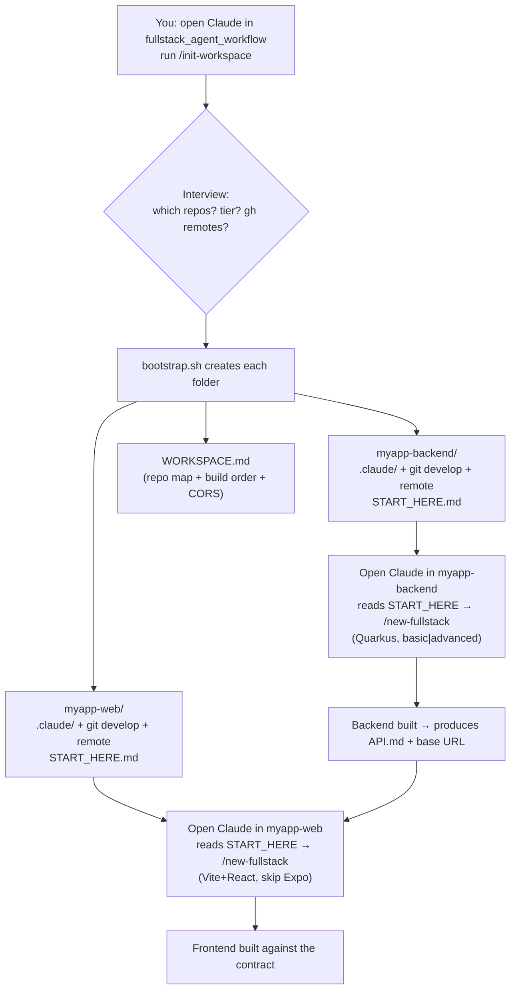
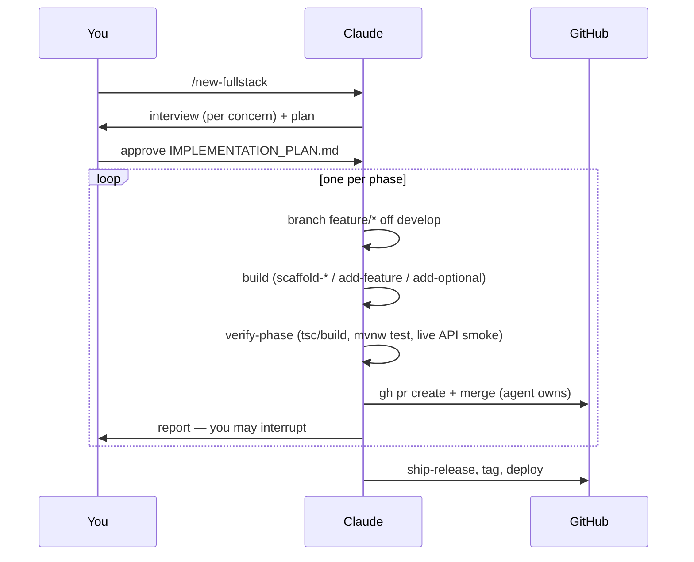

# USAGE — how to drive the workflow from Claude Code

This repo is a **Claude Code skill pack + knowledge base**. You make it available to a session, run a slash-command, and it generates + builds tailored fullstack projects under fixed conventions, gates, and gotchas.

- New here? Read `README.md` (what it is) and `PLAYBOOK.md` (the methodology).
- Want the whole flow in one picture? See the diagrams below.

---

## 1. Make the skills available to a session

Claude Code auto-discovers skills from a project's `.claude/skills/`. Three ways to get `/new-fullstack` + `/init-workspace` into a session:

| Way | How | Best for |
|---|---|---|
| **Run from this repo** | Open a Claude session in this repo; skills are already here. | bootstrapping a new workspace (`/init-workspace`) |
| **Copy `.claude/` into a project** | `cp -R <this-repo>/.claude <target>/.claude` | a single existing repo you want to build in |
| **`init-workspace` does it for you** | `/init-workspace` seeds every new repo's `.claude/` automatically | multi-repo workspaces |

The skills read `knowledge/`, `templates/`, `stacks/` from **this repo** — keep one clone on disk; each generated `START_HERE.md` records its absolute path so per-repo sessions can find the library.

---

## 2. Two ways to start

### A. Single repo — `/new-fullstack`
Open a session in the target repo (with `.claude/` present) and run `/new-fullstack`. It interviews you per concern, generates `IMPLEMENTATION_PLAN.md` + `CLAUDE.md` + structure + the building blocks, then builds phase by phase.

### B. Multi-repo workspace (recommended for backend + frontend) — `/init-workspace`
Run **once** from this repo. It creates a folder per repo, seeds each, and leaves a `START_HERE.md`. Then you open one session per folder.

**Build order matters:** backend first (it produces the API contract the frontend consumes), then frontend.

---

## 3. What each per-repo session does (the phase loop)

Every project is built spec-first, one phase = one branch = one PR, and **the agent creates AND merges every PR itself** (never co-authors). You can interrupt between phases.

Gates per phase live in `knowledge/verification.md`; the secret-guard hook blocks any commit that stages secrets.

---

## 4. The skill map

| Skill | Does |
|---|---|
| `/init-workspace` | Bootstrap a multi-repo workspace (folders + `.claude/` + git + remotes + START_HERE) |
| `/new-fullstack` | Interview + generate plan/CLAUDE.md/structure for one repo, then drive the build |
| `/scaffold-frontend` | Phase-0 frontend bootstrap (Expo / Vite / Next) |
| `/scaffold-backend` | Phase-0 Quarkus bootstrap (basic / advanced + modules) |
| `/add-feature` | Add a feature (backend 8-step hexagonal flow · frontend screen→hook→service→http) |
| `/add-optional` | Turn on i18n/e2e/storybook/ci or a backend module (messaging-kafka/spatial/ai-llm/reports/testing-native) |
| `/verify-phase` | Run the gates incl. the live API smoke test (token→curl→SQL) |
| `/ship-release` | Gitflow release → main + tag + deploy |

Knowledge: `knowledge/` (decisions, tech-matrix, optionals, conventions, verification, integrations, gotchas, tooling, deploy-gcp). Building blocks: `templates/`. Presets: `stacks/`.

---

## 5. FAQ

- **Skip Expo?** In `/init-workspace` don't select "mobile"; in `/new-fullstack` pick Vite+React for web. The Expo preset is never pulled.
- **Identical stack to the reference projects?** Accept all recommended defaults — you reproduce the reference stack 1:1 (Quarkus hexagonal + Firebase; Vite+React + TanStack Query + Zustand + Tailwind/shadcn + axios-interceptors + Firebase).
- **Public repos / secrets?** The `.gitignore` + secret-guard hook keep `.env`, `CLAUDE.md`, `IMPLEMENTATION_PLAN.md`, and service-account/Firebase JSON out of git. `.env.example` ships placeholders. Hand real test passwords to evaluators out-of-band.
- **CORS (web ↔ backend)?** Backend `quarkus.http.cors.origins` must include `http://localhost:5173,http://127.0.0.1:5173,https://<vercel-name>.vercel.app`; the Vite dev server must stay on 5173; the Vercel project name must match the regex.
- **Where do I iterate later?** This repo is the source of truth; cross-session context for the maintainer lives in Claude memory (see `MEMORY.md` index in your Claude project memory dir).
